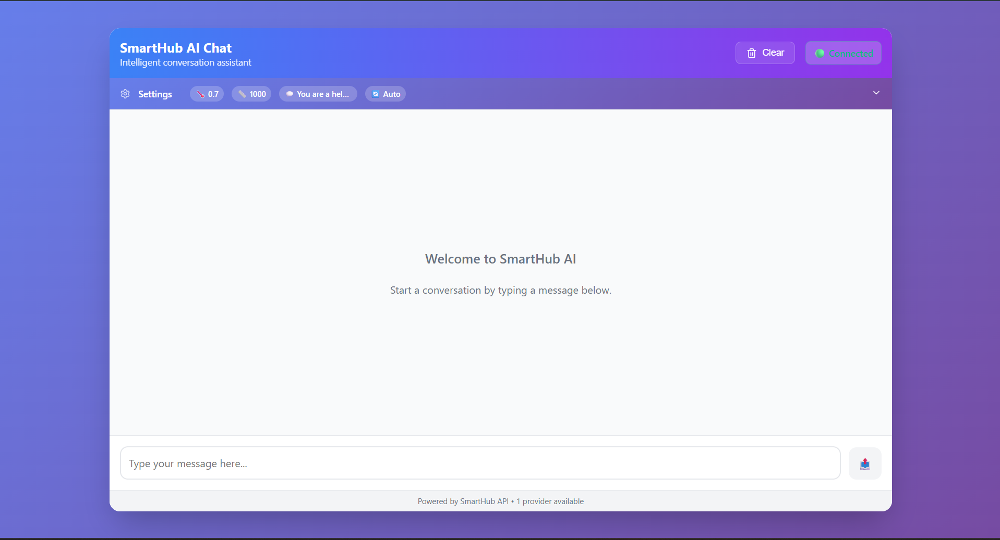
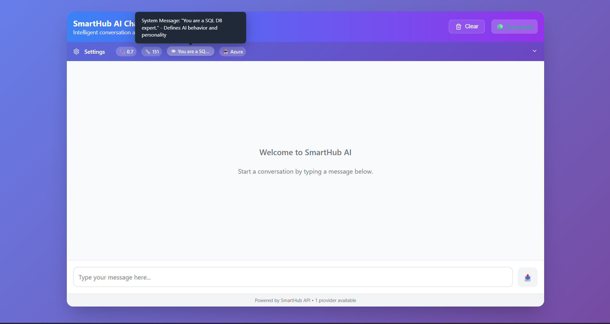
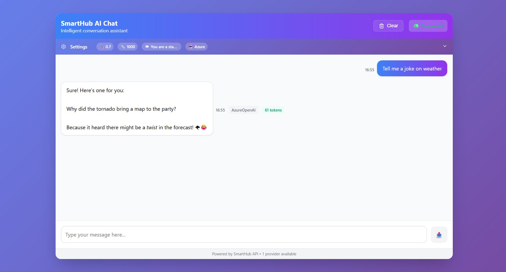
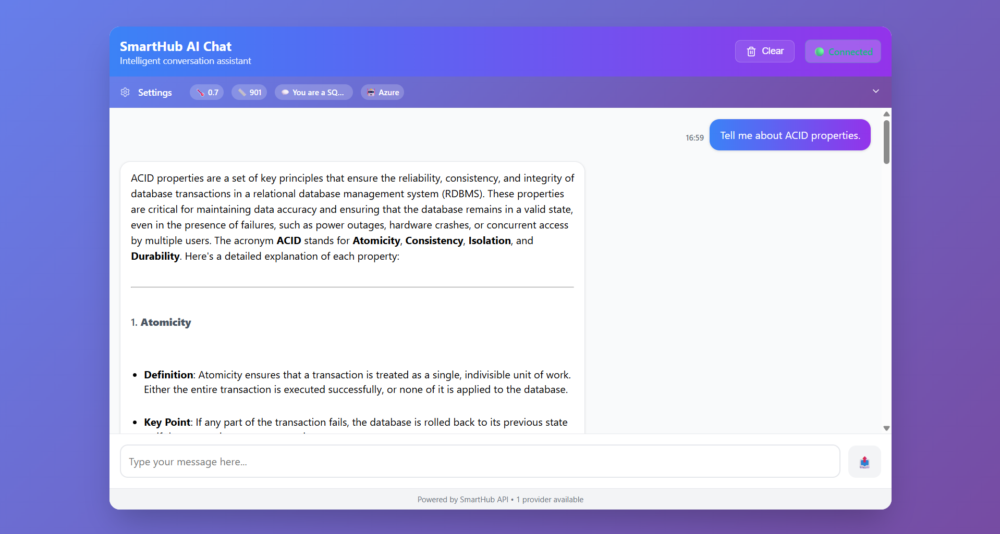
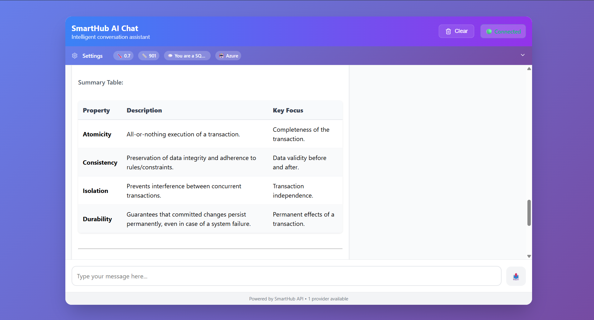
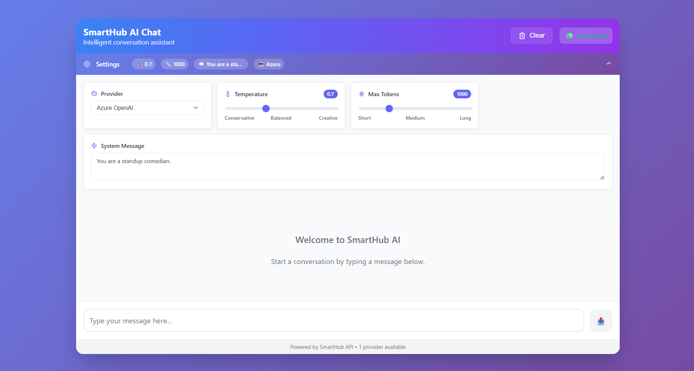
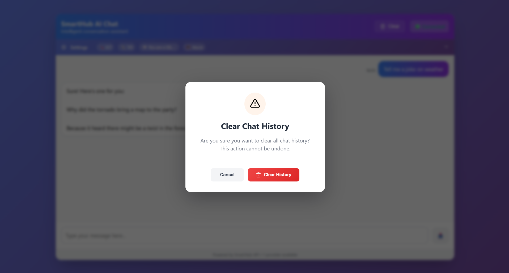
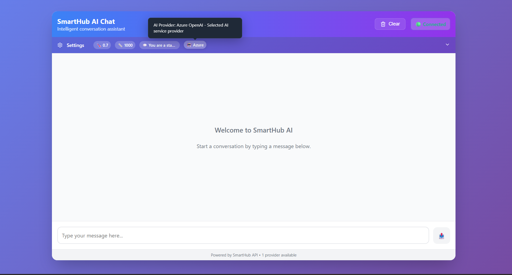
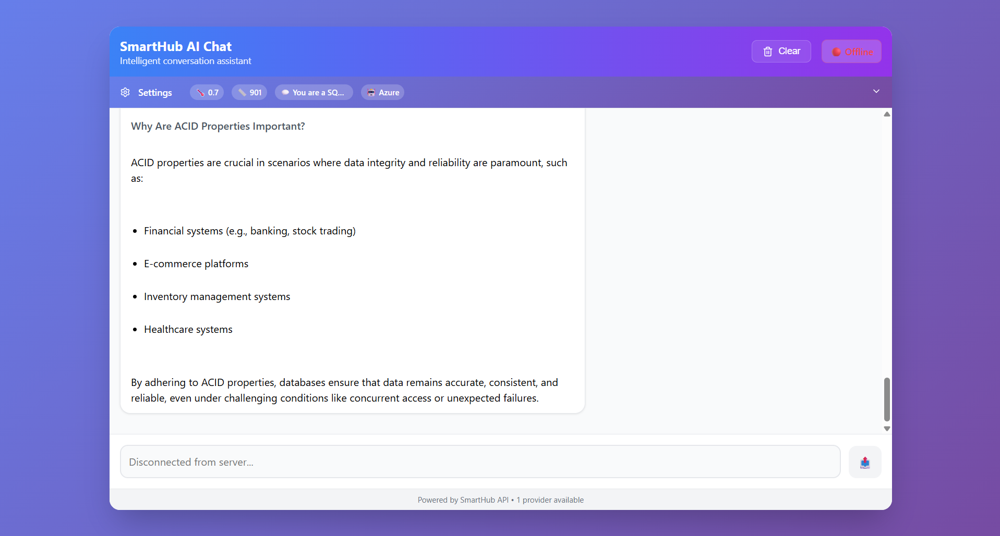

# SmartHub AI Chatbot

A complete full-stack AI chatbot solution featuring a modern React frontend and robust .NET Core API backend with support for multiple AI providers.

## 🚀 Quick Start

### Prerequisites
- Node.js 16+ and npm
- .NET 8.0 SDK
- Azure OpenAI or Amazon Bedrock API keys

### Installation & Setup

1. **Clone and setup the repository**
```bash
git clone https://github.com/crishabhkumar/AIChatbot.git
cd AIChatbot
```

2. **Setup the Backend API**
```bash
cd SmartHub.API
dotnet restore
# Configure your AI provider keys in appsettings.Development.json
dotnet run
```

3. **Setup the Frontend**
```bash
cd SmartHub.Frontend
npm install
npm start
```

4. **Access the Application**
- **Frontend**: http://localhost:3000 (or 3001 if port 3000 is busy)
- **Backend API**: http://localhost:5189
- **API Documentation**: http://localhost:5189/swagger

## 🏗️ Architecture

### Backend (SmartHub.API)
- **.NET 8.0** Web API with clean architecture
- **Multiple AI Providers**: Azure OpenAI, Amazon Bedrock
- **Swagger Documentation** for API endpoints
- **Provider Fallback** system for reliability
- **Health Monitoring** and error handling

### Frontend (SmartHub.Frontend)
- **React 18** with TypeScript
- **Tailwind CSS** for responsive design
- **Real-time messaging** with WebSocket-like experience
- **Markdown rendering** with syntax highlighting
- **Local storage** for chat persistence

## 📁 Project Structure

```
AIChatbot/
├── SmartHub.API/                 # .NET Core Web API
│   ├── Controllers/              # API controllers
│   ├── Services/                 # Business logic
│   ├── Providers/                # AI provider implementations
│   ├── Models/                   # Data models
│   ├── Interfaces/               # Service contracts
│   └── Configuration/            # App configuration
│
├── SmartHub.Frontend/            # React TypeScript frontend
│   ├── src/
│   │   ├── components/           # React components
│   │   ├── api.ts               # API integration
│   │   ├── types.ts             # TypeScript definitions
│   │   └── App.tsx              # Main application
│   ├── public/                  # Static assets
│   └── package.json             # Dependencies
│
├── .gitignore                   # Git ignore patterns
└── README.md                    # This file
```

## ✨ Features

### 🎯 Core Features
- ✅ **Multi-Provider Support**: Azure OpenAI, Amazon Bedrock
- ✅ **Real-time Chat**: Instant messaging with AI
- ✅ **Smart Fallback**: Automatic provider switching
- ✅ **Chat History**: Persistent conversation storage
- ✅ **Markdown Support**: Rich text with code highlighting
- ✅ **Responsive Design**: Mobile and desktop optimized

### ⚙️ Customization
- ✅ **Temperature Control**: Adjust AI creativity (0.0-2.0)
- ✅ **Token Limits**: Configure response length (1-4000)
- ✅ **System Messages**: Custom AI behavior instructions
- ✅ **Provider Selection**: Choose specific AI models

### 🛠️ Technical Features
- ✅ **TypeScript**: Full type safety
- ✅ **Error Handling**: Graceful error recovery
- ✅ **Connection Monitoring**: Real-time status indicators
- ✅ **Health Checks**: API monitoring and diagnostics

## � Screenshots

### Welcome Screen
Get started with a clean, modern interface that guides users through the chat experience.





### Chat Interface
Experience smooth, real-time conversations with AI in a beautifully designed chat interface.







### Settings Panel
Customize your AI experience with intuitive controls for temperature, tokens, and system behavior.



### Clear Chat History
Clean, user-friendly modal dialogs for important actions.



### Connection Status
Real-time connection monitoring with clear visual indicators.





## �🔧 Configuration

### Backend Configuration
Create `SmartHub.API/appsettings.Development.json`:
```json
{
  "AIProviders": {
    "AzureOpenAI": {
      "Endpoint": "your-azure-endpoint",
      "ApiKey": "your-api-key",
      "DeploymentName": "your-deployment"
    },
    "AmazonBedrock": {
      "Region": "us-east-1",
      "AccessKey": "your-access-key",
      "SecretKey": "your-secret-key"
    }
  }
}
```

### Frontend Configuration
Create `SmartHub.Frontend/.env`:
```env
REACT_APP_API_URL=http://localhost:5000/api
REACT_APP_ENV=development
```

## 🚀 Deployment

### Development
```bash
# Start both services
cd SmartHub.API && dotnet run &
cd SmartHub.Frontend && npm start
```

### Production Build
```bash
# Build frontend for production
cd SmartHub.Frontend
npm run build

# Build and publish API
cd SmartHub.API
dotnet publish -c Release -o ./publish
```

### Docker Deployment (Future)
```dockerfile
# Example Dockerfile for frontend
FROM node:18-alpine
WORKDIR /app
COPY package*.json ./
RUN npm ci --only=production
COPY . .
RUN npm run build
EXPOSE 3000
CMD ["npm", "start"]
```

## 📚 API Documentation

### Key Endpoints
- `POST /api/ai/generate` - Send message to specific provider
- `POST /api/ai/generate-with-fallback` - Auto-fallback messaging
- `GET /api/ai/providers` - List available providers
- `GET /api/ai/health` - Health status check

### Request Example
```json
{
  "message": "Hello, how are you?",
  "provider": "AzureOpenAI",
  "temperature": 0.7,
  "maxTokens": 150,
  "systemMessage": "You are a helpful assistant."
}
```

## 🎨 UI Components

### Core Components
- **`App.tsx`** - Main application container
- **`MessageBubble.tsx`** - Individual message display
- **`ChatInput.tsx`** - Message input with validation
- **`SettingsPanel.tsx`** - Configuration modal

### Key Features
- **Auto-scroll** to latest messages
- **Typing indicators** during AI processing
- **Character limits** with visual feedback
- **Keyboard shortcuts** (Enter to send, Shift+Enter for new line)

## 🔍 Troubleshooting

### Common Issues
1. **API Connection Failed**: Check if backend is running on port 5000
2. **AI Provider Errors**: Verify API keys in configuration
3. **Frontend Build Issues**: Clear npm cache with `npm cache clean --force`
4. **CORS Errors**: Ensure frontend URL is in API CORS policy

### Debug Commands
```bash
# Check API health
curl http://localhost:5000/api/ai/health

# Check frontend build
cd SmartHub.Frontend && npm run build

# Check backend logs
cd SmartHub.API && dotnet run --verbosity diagnostic
```

## 🤝 Contributing

1. Fork the repository
2. Create a feature branch (`git checkout -b feature/amazing-feature`)
3. Commit your changes (`git commit -m 'Add amazing feature'`)
4. Push to the branch (`git push origin feature/amazing-feature`)
5. Open a Pull Request

---

**Built with ❤️ using React, TypeScript, .NET Core, and modern web technologies.**
